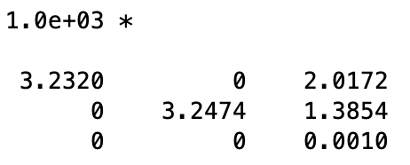

# IACVHomework
Homework for the Image Analysis and Computer Vision (IACV) course

For a more in-depth explanation read  [Report.pdf](Report.pdf)

## Input image

### Features:
##### 1) Edges detection.
   
##### 2) Corners detection.
   
##### 3) Lines detection.
   

### Geometry:
##### 4.1) Find two horizontal vanishing points and one vertical vanishing point.

##### 4.2) Look at the image below and consider the horizontal section of facades 1, 2 and 6 , depicted in yellow: metrically reconstruct this horizontal section*, so as to determine the relative coordinates of features points indicated in blue. These point features are placed (i) at the intersections between facades 1 and 2 and between facades 6 and 7, and (ii) in correspondence of borders of the windows.

##### 4.3) Estimate the calibration matrix K of the camera. Assume the camera is zero-skew, but not natural.

##### 4.4) Use the knowledge of K to rectify also a vertical facade, as, e.g., facade 1 or 4 or 2+6.

##### 4.5) Fix a suitable reference frame attached to the building, and localize the camera relative to the fixed reference.
